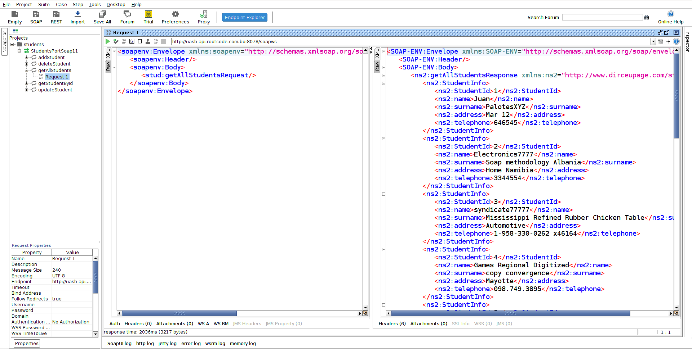
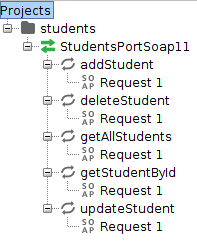

# Proyecto SOAP

Autor: Navarro Arias, Juan Dirceu.  
Modulo: Consumo de APIs.  
Universidad Andina Simón Bolivar.  
Sede, Sucre, Bolivia.  

## Descripción:
Proyecto que ofrece servicios SOAP que utiliza la misma base de datos que el proyecto [REST](https://github.com/georgeguitar/rest_enrollment_server.git)

## Herramientas utilizadas.
Sistema operativo: Debian 10 con Gnome  
IDE: Eclipse v.4.12.0  
Cliente SOAP: [SoapUI](https://www.soapui.org/) v.5.5.0   
Navegador web: Firefox 60.8.0esr

## Para consumir los servicios de SOAP.

Los servicios se consumen con el programa SoapUI, se implementó los servicios para la tabla STUDENT, se cuenta los siguientes servicios:

* addStudent
* deleteStudent
* getAllStudents
* getStudentById
* UpdateStudent.

Para consumir se utiliza la siguiente URL: [http://uasb-api.rootcode.com.bo:8078/soapws/students.wsdl](http://uasb-api.rootcode.com.bo:8078/soapws/students.wsdl) 

En SoapUI, ir a "File", "New Soap Proyect". 
En la ventana que aparece, escribir la dirección proporcionada en: “Initial WSDL”. 
Dejar seleccionada la opción: “Create sample requests for all operations” para que se cree las operaciones disponibles.

El servicio “deleteStudent” solo podrá borrar aquellos estudiantes que no estén matriculados 
(que no estén en la tabla "Enrollment"). Para hacer la prueba, se debería crear un estudiante con “addStudent” que luego borrarlo.