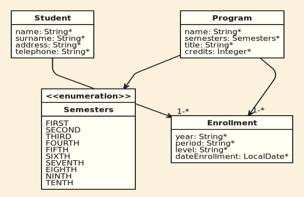

# Proyecto SOAP

Autor: Navarro Arias, Juan Dirceu.  
Modulo: Consumo de APIs.  
Universidad Andina Simón Bolivar.  
Sede Sucre, Bolivia.  

## Descripción.
Proyecto que ofrece servicios SOAP que utiliza la misma base de datos que el proyecto [REST](https://github.com/georgeguitar/rest_enrollment_server.git)

Cliente disponible en: [soap_enrollment_client](https://github.com/georgeguitar/soap_enrollment_client.git)  

## Base de datos.

El archivo *enrollmentDB.sql* contiene la base de datos para Mysql.

## Herramientas utilizadas.
Sistema operativo: Debian 10 con Gnome  
IDE: Eclipse v.4.12.0  
Cliente SOAP: [SoapUI](https://www.soapui.org/) v.5.5.0   
Navegador web: Firefox 60.8.0esr  
Framework: Spring Boot con JAXB2 para el mapeo de clases del archivo XML (esquema XSD) que contiene las operaciones CRUD disponibles.  

## Para consumir los servicios de SOAP.

Los servicios se consumen con el programa SoapUI, se implementó los servicios para las tablas **STUDENT**, **ENROLLMENT** y **PROGRAM** se cuenta los siguientes servicios:

* addStudent
* deleteStudent
* getAllStudents
* getStudentById
* UpdateStudent.

Para consumir los servicios, se utiliza las siguientes URLs:  
- [http://uasb-api.rootcode.com.bo:8078/soapws/students.wsdl](http://uasb-api.rootcode.com.bo:8078/soapws/students.wsdl)  
- [http://uasb-api.rootcode.com.bo:8078/soapws/programs.wsdl](http://uasb-api.rootcode.com.bo:8078/soapws/programs.wsdl)  
- [http://uasb-api.rootcode.com.bo:8078/soapws/enrollment.wsdl](http://uasb-api.rootcode.com.bo:8078/soapws/enrollment.wsdl)  

En SoapUI, ir a "File", "New Soap Proyect". 
En la ventana que aparece, escribir la dirección proporcionada en: “Initial WSDL”. 
Dejar seleccionada la opción: “Create sample requests for all operations” para que se cree las operaciones disponibles.

El servicio “deleteStudent” solo podrá borrar aquellos estudiantes que no estén matriculados 
(que no estén en la tabla "Enrollment"). Para hacer la prueba, se debería crear un estudiante con “addStudent” que luego borrarlo.

También se podrá consumir los servicios desde el cliente [soap_enrollment_client](https://github.com/georgeguitar/soap_enrollment_client.git)

## Comandos de maven.

### Para importar en Eclipse.
*mvn clean eclipse:eclipse*  

### Para correr el proyecto.
*mvn spring-boot:run*  

### Para crear el jar ejecutable.
*mvn clean package*  

## Para ejecutar.
*java -jar soap-dirceu-0.0.1-SNAPSHOT.jar*

## Fuentes.
[https://spring.io/projects/spring-boot](https://spring.io/projects/spring-boot)  
[https://www.concretepage.com/spring-boot/spring-boot-soap-web-service-example](https://spring.io/projects/spring-boot)
